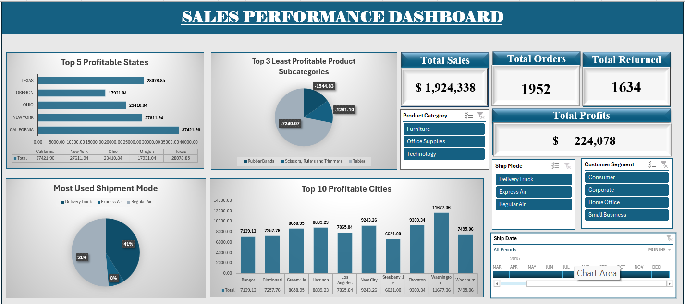
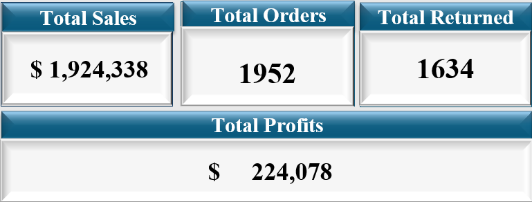
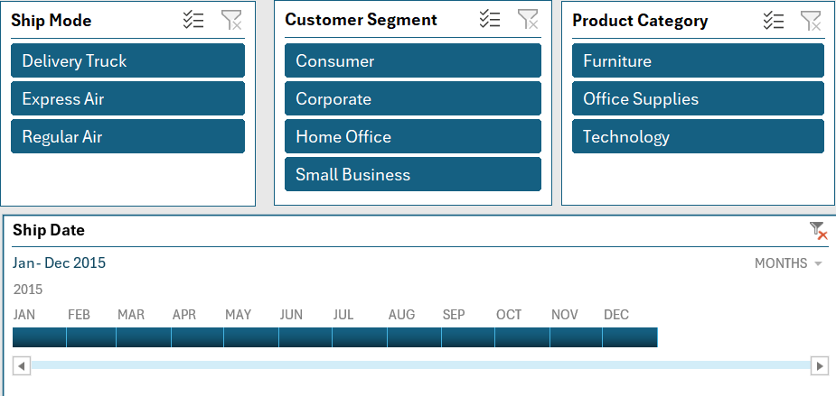
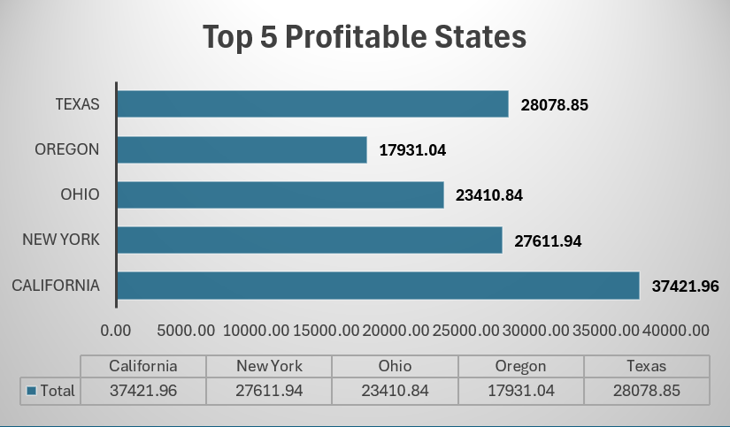

# Sales Performance Dashboard

## Overview
This project is an interactive Excel dashboard designed to analyze sales performance, profitability trends, shipment preferences, and customer segmentation insights.

The dashboard enables dynamic filtering and business analysis using Pivot Tables, Pivot Charts, Slicers, and Timeline controls.

---

## Tools & Features Used
- Microsoft Excel
- Pivot Tables
- Pivot Charts
- Slicers
- Timeline Filters
- KPI Cards
- Dashboard Design & Formatting

---

## Dashboard Features

### KPI Tracking
The dashboard provides high-level business metrics including:
- Total Sales
- Total Orders
- Total Returned Orders
- Total Profits

### Interactive Filtering
Users can dynamically filter dashboard insights using:
- Product Category
- Ship Mode
- Customer Segment
- Ship Date Timeline

### Business Insights
The dashboard highlights:
- Top 5 Profitable States
- Top 10 Profitable Cities
- Most Used Shipment Modes
- Least Profitable Product Subcategories

---

## Skills Demonstrated
- Data Visualization
- Business Analytics
- Dashboard Development
- KPI Reporting
- Interactive Reporting
- Data Storytelling
- Excel Analytics

---

# Dashboard Preview

## Full Dashboard

---

## KPI Overview

---

## Interactive Filters & Slicers

---

## Profitability Analysis

---

## Project Outcome
This dashboard was created to demonstrate Excel-based business intelligence and reporting capabilities through interactive visual analytics and KPI-driven insights.
